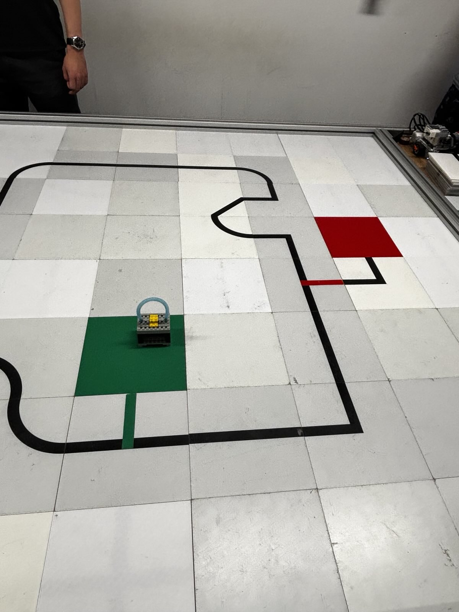
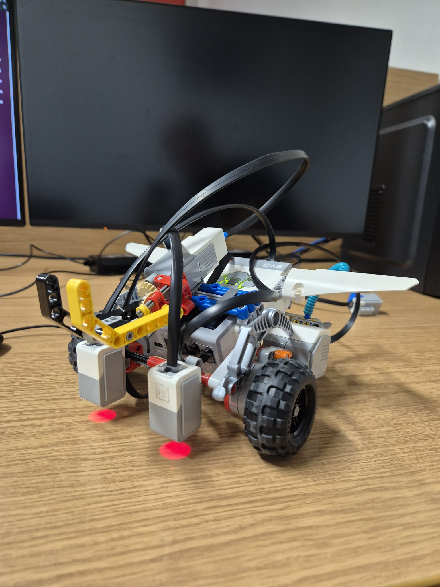
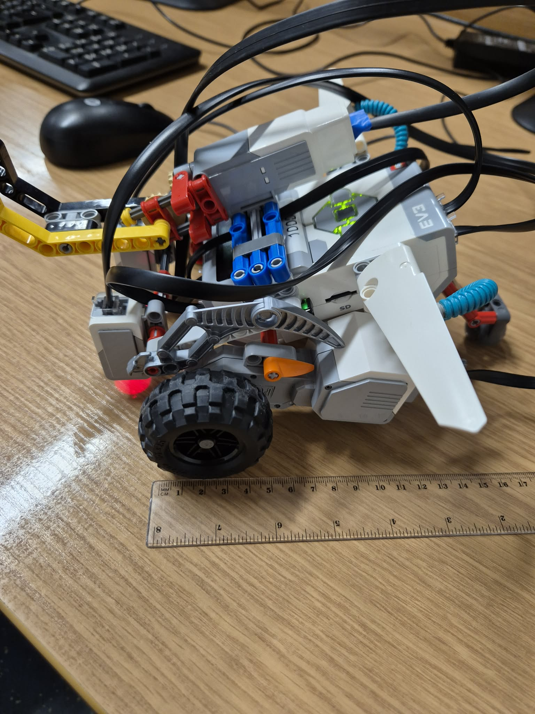
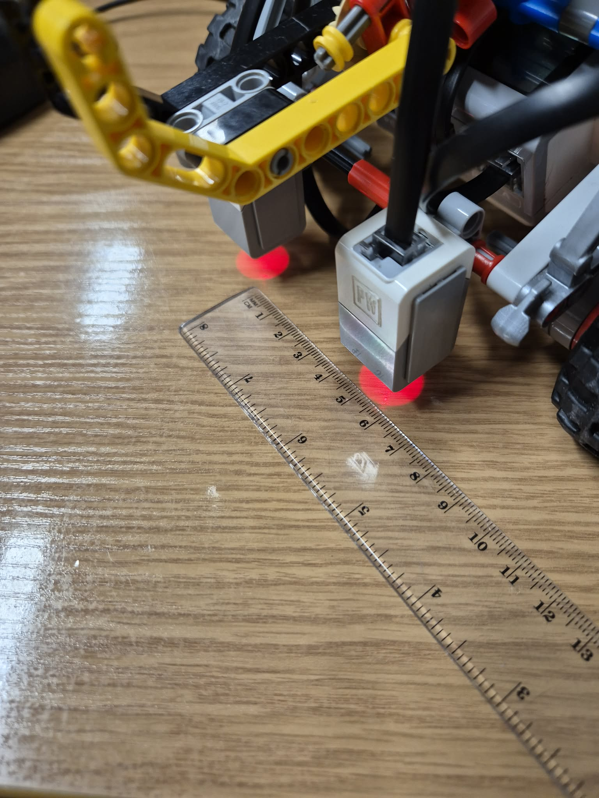
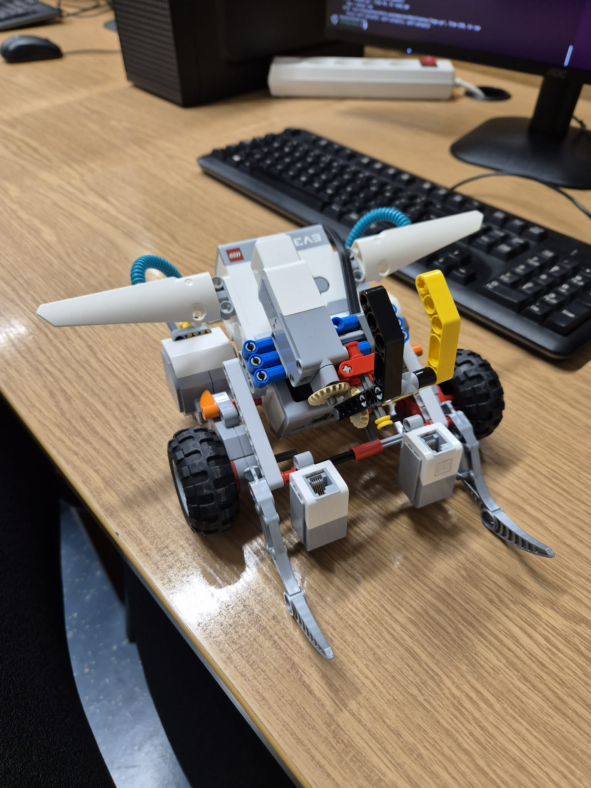

# Wstęp do Robotyki dla Informatyków
## Laboratorium
### Prowadzący
- mgr inż. Daniel Giełdowski
### Autorzy
- Jakub Kryczka 325180
- Bartosz Mączka 331402

## Realizowane zadania
### Linefollower

Zadaniem robota jest przejechanie całej trasy/tras po wyznaczonej linii. Opis planszy znajduje sie na stronie KNR Bionik. Ocenie podlegać będzie umiejętność pokonania przez robota konkretnych segmentów trasy jak i całości. Prowadzący zastrzegają sobie prawo do nagrodzenia drużyn, które pokonały trasę najszybciej dodatkowymi punktami. Każda grupa otrzyma określoną liczbę podejść do zaliczenia. Dodatkowe podejścia skutkować mogą ucięciem punktów z etapu. Robot może realizować trasę zaliczeniową startując w dowolnym jej miejscu i w dowolnym kierunku (chyba że prowadzący powie inaczej). Przejazd robota kończy się jeśli robot wykona całą trasę, robot opuści trasę a jego powrót na poprawny tor będzie niemożliwy, na decyzję drużyny która go zbudowała lub prowadzącego.

### Transporter

Zadaniem robota jest przetransportowanie obiektów z punktów bazowych do punktów docelowych. Punkt bazowy i punkt docelowy oznaczone są przez kolorowe elementy planszy. Rozwidlenie do odpowiedniego koloru jest zaznaczone na czarnej linii trasy. Ocenie podlegać będzie umiejętność robota do zrealizowania poszczególnych etapów transportu jak i całego zadania. Prowadzący zastrzegają sobie prawo do nagrodzenia drużyn, które pokonały trasę najszybciej dodatkowymi punktami. Każda grupa otrzyma określoną liczbę podejść do zaliczenia. Dodatkowe podejścia skutkować będą ucięciem punktów z etapu. Podczas zaliczenia grupa wybiera dwa kolory które rozpoznawać będzie ich robot - jeden z którego należy pobrać obiekt i drugi gdzie obiekt należy odstawić. Między kolorową odnogą a kaflem odpowiedniego koloru może znaleźć się fragment czarnej trasy. Zazwyczaj robot może jechać w dowolną stronę. Robot zaczyna przejazd na kaflu poprzedzającym rozwidlenie prowadzące do koloru lub w miejscu wskazanym przez prowadzącego. Jego zadaniem jest wjechanie na pierwszy kolorowy kafel i opuszczenie go z obiektem manipulacji, dojechanie do drugiego rozwidlenia oraz wjechanie na drugi kolorowy kafel i odstawienie przedmiotu. Przejazd robota kończy się jeśli robot wykona całe zadanie (do momentu odłożenia przedmiotu), robot opuści trasę a jego powrót na poprawny tor będzie niemożliwy, na decyzję drużyny która go zbudowała lub prowadzącego. Przedmiot manipulacji zostanie przedstawiony przez prowadzącego na pierwszych lub drugich laboratoriach. Zaliczenie zadania odbędzie się na ostatnich laboratoriach. Prowadzący mogą zażyczyć sobie dodatkowych przejazdów robota w innych warunkach i konfiguracjach w celu dokładniejszego zweryfikowania jego działania.

## Środowiska pracy

### Linefollower

Plansza, po której porusza się robot, składa się kwadratowych płytek mających różne kolory tła, w większości biały lub szary.

Trasę przejazdu robota wyznacza czarna linia znajdująca się na powierzchni płytek.

Trasa przebiega przez całą planszę, zawiera zarówno łagodne łuki, jak i ostre zakręty oraz skrzyżowania.

Zgodnie z założeniami zadania na skrzyżowaniach robot powinien kontynuować jazdę na wprost.

### Transporter

W zadaniu transportera na plansze zostały wprowadzone różnokolorowe płytki, oznaczające miejsca odbioru oraz odstawienia transportowanego obiektu.

Po testach ustaliliśmy, że nasze czujniki najlepiej radzą sobie z wykrywaniem koloru zielonego (🟢) oraz czerwonego (🔴).

Między główną ścieżką a punktem pośrednim zadania mogą pojawić się dodatkowe płytki z trasą, ważne jest więc aby robot po wykryciu skrętu o odpowiednim kolorze kontynuował poruszanie się po linii aż do znalezienia płytki o jednolitym, poszukiwanym kolorze.

W naszej konfiguracji:
- zielona płytka (🟢) - punkt odbioru przedmiotu
- czerwona płytka (🔴) - punkt dostarczenia przedmiotu



## Konstrukcja robota



### Użyte elementy

Pierwsze laboratorium było poświęcone konstrukcji robota.

Główne składowe to:

- kostka (sterownik EV3)
- czujniki koloru x2
- silniki napędowe x2
- silnik podnośnika

Do użycia dostępny był również:
- przycisk do uruchamiania robota

Jednak nie został on wykorzystany w naszym rozwiązaniu

### Układ jezdny

Nasz robot poruszał się na dwóch kołach napędzanych silnikami oraz jednej kulce podporowej.

Zdecydowaliśmy się na takie rozwiązanie ze względu na zwiększoną zwrotność, której nie dałoby się uzyskać w przypadku robota z 4 kołami.

W konstrukcji użyliśmy kół o średnicy 56mm, z dużym bieżnikiem w celu uzyskania lepszej przyczepności na gładkiej powierzchni planszy.



### Czujniki

Robot został wyposażony w dwa czujniki koloru LEGO EV3, które pełnią kluczową rolę w wykrywaniu trasy:

- Zamontowane zostały z przodu konstrukcji na uchwycie umożliwiającym regulację rozstawu oraz nachylenia względem toru, co ułatwia kalibrację i testowanie różnych konfiguracji
- Czujniki położone są symetrycznie wzlędem środka robota
- Finałowy rozstaw to ok. 4.5cm

Takie rozmieszczenie pozwala robotowi precyzyjnie podążać za linią oraz rozpoznawać momenty, w których wjeżdża na kolorowe pola planszy.



### Rozmieszczenie elementów

- Kostka zamonotana centralnie - obsługa robota z poziomu kostki jest wygodna oraz ułatwia podpięcie kabli
- Czujniki koloru z przodu robota, obok siebie, na jednej belce, co pozwala na równomierne wykrywanie kolorów po obu stronach linii.
- Silnik obsługujący chwytak został zamocowany na górze kostki, a jego ramię znajduje się z przodu robota, połączone z silnikiem dwoma zębatkami w celu uzyskania obrotu w innej osi niż oryginalna oś silnika
- Kable zostały podpięte w spoób zapewniajacy robotowi pełną mobilność
- Kulka podporowa z tyłu robota



## Zaliczenie

Oba zadania udało nam się zrealizować i zaliczć na zajęciach.

Podchodziliśmy też do przejazdów konkursowych jednak nie udało nam się ukończyć całego przejazdu z sukcesem.


## Skrypty

- 'task1.py' - skrypt implementujace zadanie podążania za linią (Linefollower)

- 'task2.py' - skrypt implementujace zadanie transportera

### Linefollower

Do rozwiązania zadania **"Linefollower"** wykorzystaliśmy prosty algorytm bezstanowy, który definiuje zachowanie robota na podstawie informacji pobranej z obu czujników. Odczyty z każdego z czujników klasyfikowaliśmy na 2 typy - **CZARNY** lub **BIAŁY**, które łącznie dają nam 4 możliwe kombinacje:

| Lewy czujnik | Prawy czujnik | Stan pojazdu | Akcja |
|---|---|---|---|
| BIAŁY ⚪ | BIAŁY ⚪ | Pojazd znajduje się na trasie | Jedź prosto |
| CZARNY⚫ | BIAŁY ⚪ | Lewa strona pojazdu najechała na linię | Skręć w lewo |
| BIAŁY ⚪ | CZARNY ⚫ | Prawa strona pojazdu najechała na linię | Skręć w prawo  |
| CZARNY ⚫ | CZARNY ⚫ | Pojazd znajduje się na skrzyżowaniu | Jedź prosto |

Aby nasz pojazd jak najlepiej utrzymywał się na trasie najważniejsza były dla nas 3 wskaźniki:
- **Responsywność pojazdu**, czyli jak ruch kół pojazdu przekłada się na pozycję czujników na których podstawie określamy trasę pojazdu. Podczas wykonywania skrętu, czujnik musi pozostać po tej samej stronie osi wyznaczanej przez linię jazdy. Oznacza to, że czujnik powinien się nieznacznie cofać podczas wykonywania operacji skrętu. Do uzyskania optymalnego położenia czujników przydatna była konstrukcja naszego robota, dzięki której mogliśmy w prosty sposób testować różny ich rozstaw.
- **Responsywność wykrywania koloru**, czyli jak dobrze robot radzi sobie z rozróżnianiem kolorów. Jak wynikło z naszych testów wbudowany w bibliotekę moduł wykrywania kolorów nie był wystarczająco responsywny dla naszego przypadku użycia. Największą responsywność zapewniał tryb w którym czujnik korzystał jedynie z intensywności odbijanego koloru czerwonego. W naszym rozwiązaniu zdecydowaliśmy się jednak na ktegoryzację odczytów na podstawie odczytów ze wszystkich 3 kanałów RGB, ze względu na zadanie **"Transporter"**, w którym poza rozróżnianiem koloru czarnego i białego, musimy być w stanie również wykrywać kolory zielony oraz czerwony. Kategoryzacja na kolor CZARNY ⚫ odbywała się na podstawie poniższego wzoru:
```python
BLACK ⚫ (bool) = RED 🔴 + GREEN 🟢 + BLUE 🔵 < 120
```
- **Czas wykonania pętli**, im krótszy czas wykonania pętli tym szybsza reakcja na zmieniający się kolor wykrywany przez czujnik. W tym przypadku oznacza to ograniczenie ilości operacji wykonywanych w każdej pętli, np. kategoryzacja wykrywanego koloru opiera się jedynie na wartości pojedynczego wskaźnika (suma kanałów RGB)

#### Uproszczona struktura algorytmu
```
1. Sczytanie wartości RGB z obu czujników
2. Kategoryzacja obu wartości
3. Określenie wykonywanej czynności na podstawie tabeli
```

### Transporter
Do rozwiązania zadania **"Transporter"** podzieliliśmy trasę, którą ma wykonać pojazd na segmenty a następnie odpowiednio zdefiniowaliśmy zachowania pojazdu w każdym z nich oraz warunki zakończenia danego segmentu jazdy.

| Nazwa stanu | Opis | Warunek Zakończenia | Możliwe kolejne stany |
|---|---|---|---|
| SEARCH_GREEN | Linefollower | Jeden z czujników wykrył kolor zielony | 1. GREEN_ON_LEFT <br/> 2. GREEN_ON_RIGHT |  
| GREEN_ON_LEFT | Skręt 90° w lewo <br/> Ustawienie zmiennej oznaczającej kierunek skrętu | N/A | SEARCH_GREEN_ZONE |  
| GREEN_ON_RIGHT | Skręt 90° w prawo <br/> Ustawienie zmiennej oznaczającej kierunek skrętu | N/A | SEARCH_GREEN_ZONE |  
| SEARCH_GREEN_ZONE | Linefollower | Oba czujniki wykryły ciemny kolor jednocześnie <br/><br/> * Zgodnie z wcześniejszymi ustaleniami na trasie nie występuje skrzyżowanie, a poszukiwanie ciemnego koloru umożliwa wykorzystanie bardziej responsywnego trybu czujników z włączonym tylko kanałem czerwonym, oraz upraszcza warunki opuszczenia stanu co skutkuje szybszymi iteracjami pętli | PICK_UP_ITEM |  
| PICK_UP_ITEM | Podnieś ramię do góry w celu podniesienia przedmiotu | N/A | RETURN TO TRACK |  
| RETURN_TO_TRACK | Obrót o 180° <br/> Następnie Linefollower | Oba czujniki wykryły ciemny kolor jednocześnie | ENTER_TRACK |  
| ENTER_TRACK | Skręt o 90° <br/> Kierunek zależny od zmiennej ustawionej w GREEN_ON_LEFT lub GREEN_ON_RIGHT | N/A | SEARCH_RED |  
| SEARCH_RED | Linefollower | Jeden z czujników wykrył kolor czerwony | 1. RED_ON_LEFT <br/> 2. RED_ON_RIGHT |  
| RED_ON_LEFT | Skręt 90° w lewo | N/A | SEARCH_RED_ZONE |  
| RED_ON_RIGHT | Skręt 90° w prawo | N/A | SEARCH_RED_ZONE |  
| SEARCH_RED_ZONE | Linefollower | Oba czujniki wykryły kolor czerwony jednocześnie | LEAVE_ITEM |  
| LEAVE_ITEM | Opuść ramię do dołu w celu odłożenia przedmiotu | N/A | RUN_FINISHED |  
| RUN_FINISHED | KONIEC | N/A | N/A |  

#### Wykrywanie koloru
Zależało nam, aby wykrywanie koloru było jak najszybsze (brak skomplikowanej struktury warunków, zagnieżdżonych if/else etc.)  
Z tego powodu klasyfikacja koloru, podobnie jak w przypadku klasyfikacji w zadaniu **"Linefollower"**, opiera się na wskaźnikach, których wzory zostały dobrane eksperymentalnie.  
Wzór na kolor CZERWONY 🔴:
```python
RED 🔴 = (RED 🔴 > (GREEN 🟢 + BLUE 🔵)) and (RED 🔴 > 80)
```
Wzór na kolor ZIELONY 🟢:
```python
GREEN 🟢 = (GREEN 🟢 + BLUE 🔵 > 3 * RED 🔴) and (RED 🔴 < 30)
```
